# AI-Driven Public Health Chatbot System Architecture

## Complete System Architecture Diagram

```mermaid
graph TB
    %% Client Layer
    subgraph "Client Systems"
        WEB[Web Application<br/>React/Next.js]
        MOBILE[Mobile App<br/>React Native]
        WHATSAPP[WhatsApp Integration<br/>Twilio API]
        SMS[SMS Gateway<br/>Twilio SMS]
    end

    %% Authentication Layer
    AUTH[Authentication Service<br/>Better Auth + OAuth]

    %% Core Application Layer
    subgraph "Core Application Components"
        WEBAPP[Web Application Server<br/>Next.js API Routes]
        CHATBOT[AI Chatbot Engine<br/>Gemini 2.0 + Custom Nodes]
        NLP[NLP Processing Engine<br/>Rasa/Dialogflow Integration]
        IMAGE[Image Analysis Service<br/>Computer Vision API]
    end

    %% Database Layer
    subgraph "Database Systems"
        POSTGRES[(Primary Database<br/>NeonDB PostgreSQL)]
        REDIS[(Cache Layer<br/>Redis)]
        VECTOR[(Vector Database<br/>Pinecone/Weaviate)]
    end

    %% External Services
    subgraph "External Health Services"
        GOVDB[Government Health Database<br/>API Integration]
        WHOAPI[WHO Health API<br/>Disease Information]
        VACCINE[Vaccination Schedule API<br/>Government Portal]
        OUTBREAK[Outbreak Alert System<br/>Real-time Monitoring]
    end

    %% AI/ML Services
    subgraph "AI/ML Processing"
        LLM[Large Language Model<br/>Gemini 2.0 Flash]
        SYMPTOM[Symptom Detection AI<br/>Custom Trained Model]
        DIAGNOSIS[Diagnosis Assistant<br/>Medical Knowledge Base]
        TRANSLATE[Multilingual Support<br/>Google Translate API]
    end

    %% Communication Services
    subgraph "Communication Services"
        EMAIL[Email Service<br/>SendGrid/AWS SES]
        PUSH[Push Notifications<br/>Firebase Cloud Messaging]
        ALERT[Alert System<br/>Real-time Notifications]
    end

    %% Cloud Infrastructure
    subgraph "Cloud Infrastructure"
        AWS[AWS Cloud Services<br/>EC2, S3, Lambda]
        CDN[Content Delivery Network<br/>CloudFront]
        LOADBALANCER[Load Balancer<br/>Application Load Balancer]
    end

    %% User Roles and Access
    subgraph "User Roles & Access Control"
        PUBLIC[Public Users<br/>Basic Health Queries]
        RURAL[Rural Population<br/>Local Language Support]
        DOCTOR[Healthcare Providers<br/>Advanced Features]
        ADMIN[System Administrators<br/>Full Access]
        GOV[Government Officials<br/>Outbreak Monitoring]
    end

    %% Core Features
    subgraph "Core Features"
        SYMPTOMCHECK[Symptom Checker<br/>AI-Powered Analysis]
        VACCINESCHED[Vaccination Scheduler<br/>Personalized Reminders]
        DISEASEINFO[Disease Information<br/>Educational Content]
        DOCTORCONSULT[Doctor Consultation<br/>Telemedicine Integration]
        OUTBREAKALERT[Outbreak Alerts<br/>Real-time Notifications]
        HEALTHEDU[Health Education<br/>Preventive Care]
    end

    %% Data Flow Connections
    WEB --> AUTH
    MOBILE --> AUTH
    WHATSAPP --> AUTH
    SMS --> AUTH

    AUTH --> WEBAPP
    WEBAPP --> CHATBOT
    WEBAPP --> NLP
    WEBAPP --> IMAGE

    CHATBOT --> LLM
    CHATBOT --> SYMPTOM
    CHATBOT --> DIAGNOSIS
    CHATBOT --> TRANSLATE

    NLP --> POSTGRES
    IMAGE --> SYMPTOM
    CHATBOT --> POSTGRES
    CHATBOT --> REDIS
    CHATBOT --> VECTOR

    WEBAPP --> GOVDB
    WEBAPP --> WHOAPI
    WEBAPP --> VACCINE
    WEBAPP --> OUTBREAK

    WEBAPP --> EMAIL
    WEBAPP --> PUSH
    WEBAPP --> ALERT

    %% User Role Access
    PUBLIC --> SYMPTOMCHECK
    PUBLIC --> DISEASEINFO
    PUBLIC --> HEALTHEDU

    RURAL --> SYMPTOMCHECK
    RURAL --> DISEASEINFO
    RURAL --> HEALTHEDU
    RURAL --> TRANSLATE

    DOCTOR --> SYMPTOMCHECK
    DOCTOR --> DOCTORCONSULT
    DOCTOR --> DIAGNOSIS

    ADMIN --> SYMPTOMCHECK
    ADMIN --> DOCTORCONSULT
    ADMIN --> OUTBREAKALERT
    ADMIN --> VACCINESCHED

    GOV --> OUTBREAKALERT
    GOV --> OUTBREAK

    %% Infrastructure
    WEBAPP --> AWS
    CHATBOT --> AWS
    POSTGRES --> AWS
    REDIS --> AWS
    VECTOR --> AWS

    %% Styling
    classDef client fill:#e1f5fe
    classDef core fill:#f3e5f5
    classDef database fill:#e8f5e8
    classDef external fill:#fff3e0
    classDef ai fill:#fce4ec
    classDef communication fill:#f1f8e9
    classDef cloud fill:#e3f2fd
    classDef user fill:#fff8e1
    classDef feature fill:#f9fbe7

    class WEB,MOBILE,WHATSAPP,SMS client
    class WEBAPP,CHATBOT,NLP,IMAGE core
    class POSTGRES,REDIS,VECTOR database
    class GOVDB,WHOAPI,VACCINE,OUTBREAK external
    class LLM,SYMPTOM,DIAGNOSIS,TRANSLATE ai
    class EMAIL,PUSH,ALERT communication
    class AWS,CDN,LOADBALANCER cloud
    class PUBLIC,RURAL,DOCTOR,ADMIN,GOV user
    class SYMPTOMCHECK,VACCINESCHED,DISEASEINFO,DOCTORCONSULT,OUTBREAKALERT,HEALTHEDU feature
```

## Detailed Component Analysis

### 1. Client Systems Layer
- **Web Application**: React/Next.js based responsive web interface
- **Mobile App**: React Native cross-platform mobile application
- **WhatsApp Integration**: Direct chatbot access via WhatsApp Business API
- **SMS Gateway**: SMS-based health queries for low-tech users

### 2. Authentication & Security
- **Better Auth**: Modern authentication system with OAuth support
- **Role-based Access Control**: Different access levels for different user types
- **Data Privacy**: HIPAA-compliant data handling for health information

### 3. Core Application Components
- **Web Application Server**: Next.js API routes handling all requests
- **AI Chatbot Engine**: Gemini 2.0 powered conversational AI
- **NLP Processing**: Rasa/Dialogflow for natural language understanding
- **Image Analysis**: Computer vision for symptom image analysis

### 4. Database Architecture
- **Primary Database**: NeonDB PostgreSQL for structured data
- **Cache Layer**: Redis for session management and quick responses
- **Vector Database**: Pinecone/Weaviate for semantic search and knowledge retrieval

### 5. External Health Services Integration
- **Government Health Database**: Real-time health data from government APIs
- **WHO Health API**: International disease information and guidelines
- **Vaccination Schedule API**: Government vaccination program integration
- **Outbreak Alert System**: Real-time disease outbreak monitoring

### 6. AI/ML Processing Layer
- **Large Language Model**: Gemini 2.0 Flash for conversational AI
- **Symptom Detection AI**: Custom trained model for symptom analysis
- **Diagnosis Assistant**: Medical knowledge base integration
- **Multilingual Support**: Google Translate API for local language support

### 7. Communication Services
- **Email Service**: SendGrid/AWS SES for notifications and alerts
- **Push Notifications**: Firebase Cloud Messaging for mobile alerts
- **Alert System**: Real-time outbreak and health alerts

### 8. Cloud Infrastructure
- **AWS Cloud Services**: Scalable cloud infrastructure
- **Content Delivery Network**: CloudFront for global content delivery
- **Load Balancer**: Application Load Balancer for traffic distribution

## User Roles and Access Control

### Public Users
- Basic health queries and symptom checking
- Disease information access
- Health education content
- Multilingual support for rural populations

### Rural Population
- Local language support (Odia, Hindi, etc.)
- SMS-based access for low-tech users
- Voice-based interaction capabilities
- Offline mode for areas with poor connectivity

### Healthcare Providers
- Advanced symptom analysis tools
- Doctor consultation features
- Patient management capabilities
- Medical knowledge base access

### System Administrators
- Full system access and management
- User management and analytics
- Content management and updates
- System monitoring and maintenance

### Government Officials
- Outbreak monitoring and alerting
- Public health analytics and reporting
- Policy implementation tools
- Emergency response coordination

## Core Features Implementation

### 1. Symptom Checker
- AI-powered symptom analysis using Gemini 2.0
- Image-based symptom detection
- Multi-step questionnaire for comprehensive analysis
- Risk assessment and recommendation engine

### 2. Vaccination Scheduler
- Personalized vaccination reminders
- Government vaccination program integration
- Local vaccination center information
- Appointment scheduling capabilities

### 3. Disease Information
- Comprehensive disease database
- Prevention and treatment information
- Local health statistics and trends
- Educational content and resources

### 4. Doctor Consultation
- Telemedicine integration
- Appointment booking system
- Medical record management
- Prescription and treatment tracking

### 5. Outbreak Alerts
- Real-time disease outbreak monitoring
- Location-based alert system
- Government health department integration
- Emergency response coordination

### 6. Health Education
- Preventive care information
- Healthy lifestyle guidance
- Disease prevention strategies
- Community health programs

## Technical Implementation Details

### API Integration Points
- **Government Health Database**: RESTful API integration for real-time health data
- **WHO Health API**: International health information and guidelines
- **Vaccination Schedule API**: Government vaccination program data
- **Outbreak Alert System**: Real-time monitoring and alerting

### Data Flow Architecture
1. **User Input**: Web/Mobile/WhatsApp/SMS → Authentication → Core Application
2. **AI Processing**: Input → NLP → LLM → Symptom Analysis → Response Generation
3. **External Data**: Government APIs → Data Processing → Database Storage
4. **Response Delivery**: AI Response → User Interface → User Notification

### Scalability Considerations
- **Microservices Architecture**: Modular service design for scalability
- **Load Balancing**: Application Load Balancer for traffic distribution
- **Database Sharding**: Horizontal scaling for database operations
- **CDN Integration**: Global content delivery for better performance

### Security and Privacy
- **Data Encryption**: End-to-end encryption for health data
- **HIPAA Compliance**: Healthcare data privacy standards
- **Access Control**: Role-based access control system
- **Audit Logging**: Comprehensive logging for compliance

## Deployment Architecture

### Cloud Infrastructure
- **AWS EC2**: Application server instances
- **AWS S3**: Static content and file storage
- **AWS Lambda**: Serverless functions for specific tasks
- **AWS RDS**: Managed PostgreSQL database
- **AWS ElastiCache**: Redis cache layer

### Monitoring and Analytics
- **Application Monitoring**: Real-time system health monitoring
- **User Analytics**: Usage patterns and engagement metrics
- **Health Analytics**: Disease trends and outbreak patterns
- **Performance Monitoring**: System performance and optimization

This comprehensive architecture ensures that your AI-Driven Public Health Chatbot can effectively serve rural and semi-urban populations with multilingual support, government health database integration, and real-time outbreak monitoring capabilities.

